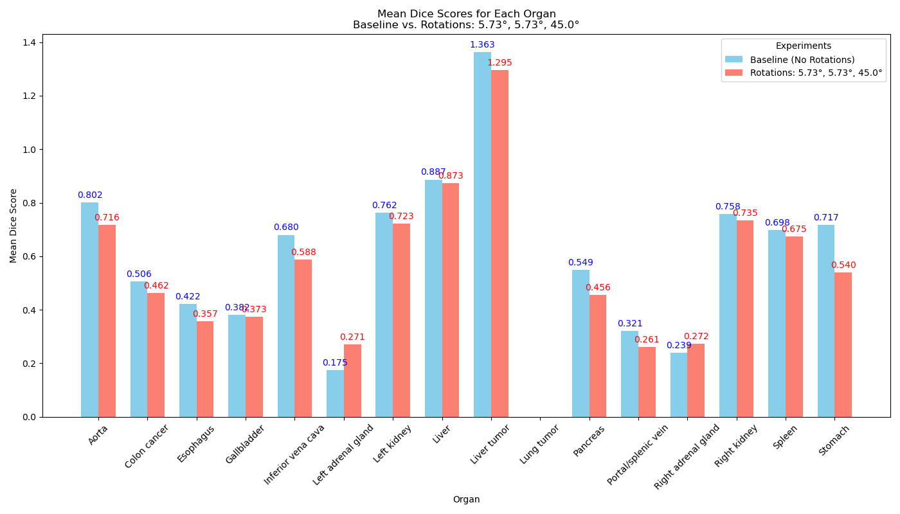

# Medical Multimodal Segmentation Using Foundation Models

### Danny van den Berg, Jesse Brouwers, Taiki Papandreou, and Roan van Blanken

---

This repository contains a reproduction and extension of ["SegVol: Universal and Interactive
Volumetric Medical Image Segmentation"](https://arxiv.org/abs/2311.13385) by Du et al. (2023). 

To read the full report containing detailed information on our reproduction experiments and extension study, please, refer to our [blogpost](blogpost.md).

## Requirements

First you need to clone this repository by:

```clone
git clone https://github.com/DB19222/DL2-group5-med-seg.git
```

To install requirements and activate environment:

```setup
virtualenv venv
source venv/bin/activate
pip install -r requirements.txt
```

To download the M3D-Seg dataset:

```data
python src/download_dataset.py
```

## Training and Inference
### Training
You can train the SegVol model with the following command:
```train

```

### Inference
You can inferene the SegVol model with the following command:
```inference

```
## Evaluation and Demos

To perform evaluation of the results and reproduce our results, refer to the corresponding notebooks in the [`demos/`](demos/) folder.
The demo folder consists the following notebooks.

```
demos
.
|-- create_figures.ipynb    # Plots our results on the robustness of the SegVol model              
|
|-- organ_count_and_data_transformation.ipynb   # Statistics on the used dataset
|
|-- organ_rotations.ipynb   # Showcasing rotation mechanics visually, which are utilized in our novel contribution.
|
|-- csv_files       # Contains CSV files needed for create_figures.ipynb
```

## Results

### Reproduction


### Novel Contribution

Figure 1 presents the average Dice score across all datasets for each organ, indicating that rotations of 45 degrees on the Z-axis and 5.73 degrees on the X and Y axes yield poorer performance in terms of Dice scores for organ segmentation. These findings suggest that SegVol is not robust to rotations and has room for improvement in this regard.

Keep in mind that we are still trying to incorporate the group equivariance into SegVol in an attempt to mitigate this problem. We antipate that we get our results this week and the result should in theory narrow down the score difference.

<table align="center">
  <tr align="center">
      <td></td>
  </tr>
  <tr align="center">
    <td colspan=2><b>Figure 1.</b> Difference in mean Dice scores in detail for each organ.</td>
  </tr>
</table>

---

## Snellius Compute Cluster Reproduction Instructions

In addition to having the ability to reproduce the results locally as described above, the repository contains a set of `.job` files stored in [`jobs/`](jobs) which have been used to run the code on the Senllius Compute Cluster. Naturally, if used elsewhere, these files must be adjusted to accommodate particular server requirements and compute access. In order to replicate the results in full, the following must be executed (in the specified order):

To retrieve the repository and move to the corresponding folder, run the following:

```repository
git clone git@github.com:DB19222/DL2-group5-med-seg.git
cd DL2-group5-med-seg/
```

To install the requirements, run the following:

```requirements
sbatch job_files/DL2_setup_env.job
```

To install the dataset, run the following:
```
sbatch job_files/DL2_download_data.job
```

For performing inference task, run the following:
```
sbatch job_files/DL2_inference.job
```

