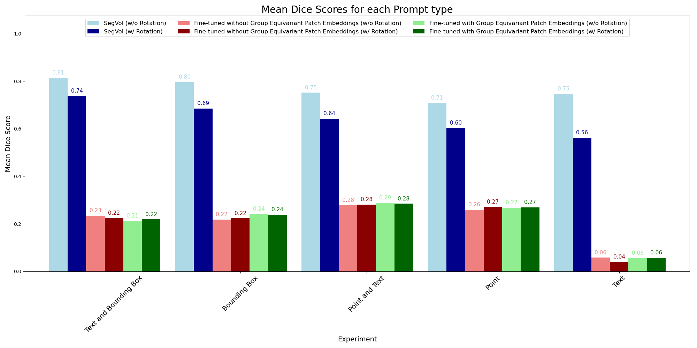

# Medical Multimodal Segmentation Using Foundation Models

### Danny van den Berg, Jesse Brouwers, Taiki Papandreou, and Roan van Blanken

---

This repository contains a reproduction and extension of ["SegVol: Universal and Interactive
Volumetric Medical Image Segmentation"](https://arxiv.org/abs/2311.13385) by Du et al. (2023). 


<table align="center">
  <tr align="center">
      <td></td>
  </tr>
  <tr align="center">
  </tr>
</table>

To read the full report containing detailed information on our reproduction experiments and extension study, please, refer to our [blogpost](blogpost.md).

## Requirements

First you need to clone this repository by:

```clone
git clone https://github.com/DB19222/DL2-group5-med-seg.git
```

To install requirements and activate environment, take a look at our `setup_environment.md` walkthrough!

## Dataset

The dataset used in this project is the [M3D-Seg](https://huggingface.co/datasets/GoodBaiBai88/M3D-Seg) dataset. The dataset can be downloaded from huggingface and can be used to train and evaluate the model. The dataset contains 3D medical images and their corresponding segmentation masks. The dataset is divided into training and validation sets.

## Training and Inference
### Training
You can train/fine-tune the SegVol model, with or without our proposed ViT, using the following script:
```train
sbatch ./scripts/DL2_train.job
```

### Inference
You can reproduce our experimental  the SegVol model using the following script:
```inference
sbatch ./scripts/DL2_evaluation.job
```
## Demo

To get some more details and insights on the proposed patchembedding block with the induced rotational bias, we refer you to our demo:

```
Demo
.
|-- SO3_patchembedding.ipynb   # Plots our results on the robustness of the SegVol model              
```

## Results

In this work, we have extensively analysed the paper "SegVol: Universal and Interactive Volumetric Medical Image Segmentation",
and have reproduced a subset of the experiments performed in the paper with the aim to validate claims made by the authors on the architecture. 

### Reproduction

The results of the reproduction experiments where we evaluate inference performance of the segmentation foundation model using different prompt-types, are summarized in the following Table:

<div align="center">
  <table>
    <caption><b>Table 2: </b>Results for reproducing Experiment 1</caption>
    <thead>
      <tr>
        <th align="center"></th>
        <th align="center">SegVol BBox+text (Paper Exp. 1)</th>
        <th align="center">SegVol BBox+text (Ours)</th>
        <th align="center">SegVol BBox (Ours)</th>
        <th align="center">SegVol Point+text (Ours)</th>
        <th align="center">SegVol Point (Ours)</th>
        <th align="center">SegVol text (Ours)</th>
      </tr>
    </thead>
    <tbody>
      <tr>
        <td align="center">Mean dice score</td>
        <td align="center">0.83</td>
        <td align="center">0.81</td>
        <td align="center">0.80</td>
        <td align="center">0.75</td>
        <td align="center">0.70</td>
        <td align="center">0.75</td>
      </tr>
    </tbody>
  </table>
</div>

### Novel Contribution

After determining that there exists room for improvement in terms of robustness against global rotations of the input volume, we explore incorporating a rotational inductive bias using parameter-efficient model adaptation techniques. A summarization of our findings is provided by the following Figure:

<table align="center">
  <tr align="center">
      <td></td>
  </tr>
  <tr align="left">
    <td colspan=2><b>Figure 1.</b> Mean dice score across all organs for the different prompt types considering SegVol and the two adapted models. The origal SegVol model was trained for 2000 epochs, the fine-tuned model without Group Equivariant Patch Embeddings was trained for 30 epochs and the model with the Group Equivariant Patch Embeddings was trained for 25 epochs. </td>
  </tr>
</table>

## Snellius Compute Cluster Reproduction Instructions

In addition to having the ability to reproduce the results locally as described above, the repository contains a set of `.job` files stored in [`jobs/`](jobs) which have been used to run the code on the Senllius Compute Cluster. Naturally, if used elsewhere, these files must be adjusted to accommodate particular server requirements and compute access. In order to replicate the results in full, the following must be executed (in the specified order):

To retrieve the repository and move to the corresponding folder, run the following:

```repository
git clone git@github.com:DB19222/DL2-group5-med-seg.git
cd DL2-group5-med-seg/
```

To install the requirements, run the following:

```requirements
sbatch job_files/DL2_setup_env.job
```

