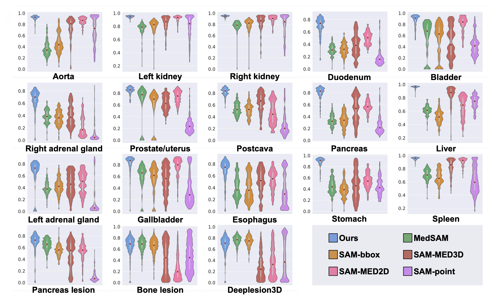
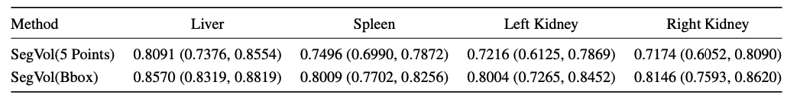
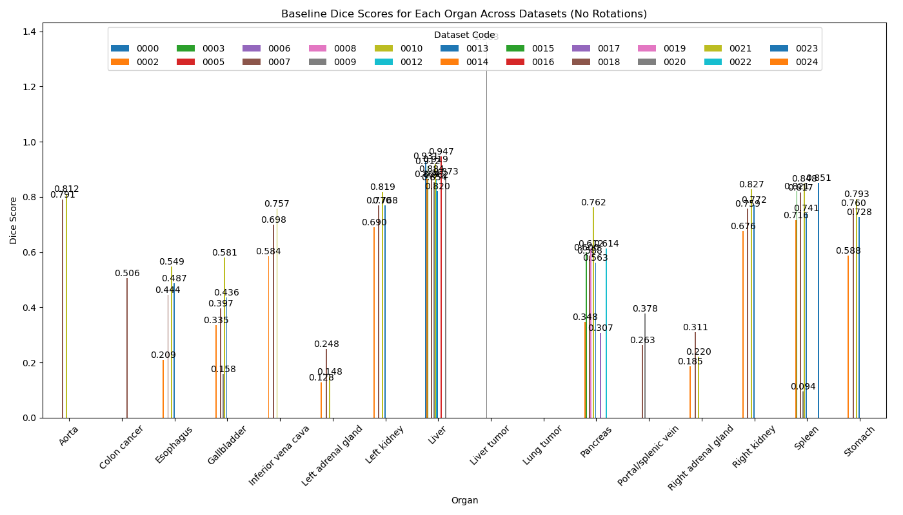
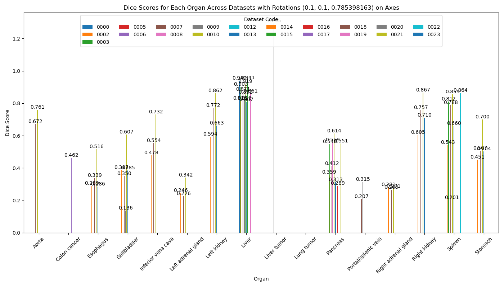

# Medical Multimodal Segmentation Using Foundation Models

### Danny van den Berg, Jesse Brouwers, Taiki Papandreou, and Roan van Blanken
#### Teaching Assistant: Stefanos Achlatis

## Overview

In this blog post, we discuss, reproduce, and extend on the findings of the paper titled ”SegVol: Universal and Interactive Volumetric Medical Image Segmentation”. The paper introduces an 3D foundation segmentation model (SegVol) supporting universal and interactive volumetric medical image segmentation. The authors showcase the effectiveness of SegVol in the domain of medical imaging.

The purpose of this blog post is threefold:

1. Help other researchers understand SegVol
2. Verify the authors’ claims by reproducing the results.
3. Extend on discussion points of the paper. 

## Introduction to SegVol
### An analysis of the paper and its key components

The paper ”SegVol: Universal and Interactive Volumetric Medical Image Segmentation” [4] introduces a 3D foundation model for interactive volumetric medical image segmentation. Volumetric image segmentation, where 3D regions of interest such as organs, tumors, or lesions are modeled from medical images, plays an increasingly prevalent role in clinical applications such as tumor monitoring and disease diagnosis, making it a highly relevant topic of research. SegVol is a segmentation model that directly acts on 3D volumetric data rather than 2D medical segmentation models acting on 2D slices of a volume. This approach is more challenging due to the high resource consumption required for computation on such volumes and the scarcity of labeled data.

The authors identify three critical limitations that hinder significant advancement in 3D segmentation models. Firstly, publicly available volumetric medical image data is scarce and usually consists of a small number of mask annotations. Secondly, the label spaces of different datasets differ slightly (e.g., left lung and right lung instead of lung), making it challenging for traditional models to disambiguate between the two due to their lack of capacity to capture the semantics of labels. Finally, previous solutions are computationally demanding in the inference process. Recent solutions have employed segmentation models using spatial prompts, but most do not process 3D input directly, and none understand the semantics of anatomical categories. This work claims to mitigate all these challenges.

The primary contributions that address the aforementioned challenges are large-scale pre-training and fine-tuning of the proposed multi-modal model on a large dataset consisting of a collection of publicly available CT-scan image datasets. The authors contribute an innovative prompt mechanism that enables segmentation based on both spatial and semantic prompts, which enables interactive usage during inference and is claimed to positively contribute to performance. Additionally, the authors contribute a zoom-out-zoom-in strategy that supposedly significantly reduces the cost of computation. The SegVol architecture is also claimed to be generalizable to other modalities such as MRI data. Finally, the authors claim that SegVol achieves state-of-the-art results in comparison with traditional task-specific techniques, and other interactive volumetric medical image segmentation models.

In this blog post, the aim is to take a deep dive into the field of medical imaging by covering this paper in detail and validating the claims made by the authors by reproducing a subset of the experiments presented in the paper and we will report on the reproducibility of this work. Furthermore, we will assess the robustness of the model to rotational augmentations of the input data and substantiate a hypothesized solution to this shortcoming based on group equivariant deep learning. Next, we will cover the method in greater detail.

## Method

*In this section, SegVol is explained in greater detail.*

### Dataset and its processing

To tackle the main challenge in volumetric medical image segmentation, namely the absence of large open-source volumetric medical datasets containing annotated CT-scans, the authors collected 25 datasets that are publicly available and combined them into one large dataset. As the wide variety of volumes in this dataset originate from different machines, with varying parameter settings, the data has a notably wide distribution. To mitigate this problem, the authors standardize the dataset. An additional challenge is the problem of missing labels, as numerous datasets contain only labels for a small number of targets. This may result in the model learning correlations between datasets and segmentation targets, which may result reduced performance during inference. To mitigate this problem, the authors apply the unsupervised Felzenswalb-Huttenlocher (FH) algorithm [5] to generate pseudo-masks. This helps break dataset-specific learning, i.e. it helps mitigate the problem of a model learning to associate certain targets with datasets rather than learning the true anatomical features. Next, we will cover the architecture of the foundation model.

### Model architecture

A holistic view of the model is shown in Figure 1:

<table align="center">
  <tr align="center">
      <td></td>
  </tr>
  <tr align="left">
    <td colspan=2><b>Figure 1.</b> Graphic overview of SegVol [4].</td>
  </tr>
</table>

The model consists of 5 core components: An image encoder that embeds the volume, a spatial encoder that embeds the spatial prompts, a semantic encoder that embeds the labels, a fusion encoder which encodes the embeddings of different modalities into mask embeddings and finally a mask decoder that decodes these embeddings to produce output masks. For the image encoder, the Vision Transformer (ViT) [3] is employed to encode the CT-scan volume as a sequence of patch-blocks. This is performed using pre-training according to the SiMiM algorithm [14] on the entire dataset, followed by fine-tuning on a subset of six thousand volumes. As semantic label encoder, SegVol employs the text encoder from CLIP [12]. CLIP is used off the shelf by using the template: ”A computerized tomography of a .”, and is frozen during training. Inspired by the foundation model for segmentation, segment-anything-model (SAM) [11], the authors use the point and bounding-box prompts to create spatial embeddings. Finally, self-attention and cross-attention represented by the fusion encoder combines the embeddings of the different modalities which to generate the final mask embeddings. Using transposed convolutions and interpolation the predicted mask is generated.

A key innovation this work contributes, is the zoom-out-zoom-in mechanism. A critical challenge of segmentation on volumetric data is the size of a data sample. The authors identify that downsampling the resolution of the input image, which is applied in many other work, causes significant information loss and therefore negatively impacts performance. To address this problem, the authors employ the zoom-out-zoom-in mechanism, which consists of multi-size training and zoom-out-zoom-in inference. The multi-size training consists of jointly training on the entire volume resized to model-input size, and on blocks of model-input size obtained from the original model. During inference the model crops the input image around a region-of-interest (ROI), and performs inference on this cropped image, supposedly resulting in more computationally efficient inference.

### Evaluation Metrics

To evaluate, the original authors employ the Dice Similarity Coefficient (Dice score) to evaluate the model’s performance. The Dice score is defined as:
$$
\begin{align} 
\text{Dice Score} = \frac{2|X \cap Y|}{|X| + |Y|}
\end{align}
$$

In this equation, |X ∩ Y| represents the cardinality of the intersection between the predicted segmentation set X and the ground truth set Y. The terms |X| and |Y| refer to the cardinalities of the sets X and Y, respectively. The Dice score is a widely used metric in image segmentation tasks, as it quantifies the similarity between the predicted and true segmentations. This makes it particularly effective for assessing the degree of overlap in binary segmentation results.

## Experiments

If it is necessary to shorten this paragraph, we can also consider removing the summarisation of the experiments that we do not cover in our reproducibility study

In this section, a brief overview is provided on the experiments the authors have conducted to validate their claims, accompanied by some critical notes on the problems we encountered for reproducibility.

### Experiment 1

First, the authors compare their model against task-specific segmentation models, both CNN-based and transformer-based. Validation experiments are performed on a subset of five datasets that have not been seen during training. The tasks focus on organ and lesion segmentation. The results of this experiment are shown using violin plots in Figure 2.

<table align="center">
  <tr align="center">
      <td></td>
  </tr>
  <tr align="left">
    <td colspan=2><b>Figure 2.</b> Violin plots for comparing experiment results of SegVol and task-specific methods. The vertical axis shows the Dice score [4].</td>
  </tr>
</table>

This figure demonstrates that SegVol is performing as the best, or one of the best on average in all segmentation tasks evaluated in this experiment. This is showcased by the red dots within each violin. Additionally, this figure demonstrates that SegVol has a much narrower distribution in comparison with the other methods which suggests that SegVol is more robust than the other methods. This experiment effectively demonstrates SegVol to outperform task-specific models on a wide variety of segmentation tasks. To validate the claim that SegVol achieves state-of-the-art performance in medical image segmentation, the authors additionally have to compare with other interactive segmentation methods which is done next.

Note on reproducibility : The SegVol model is able to perform inference based on spatial prompts, and textual semantic prompts which can be used in different configurations. It is however not possible to jointly use spatial point prompts and bounding-box prompts during inference. The authors provide no specification on the used prompt configuration, causing a problem when validating these results.

### Experiment 2

In the second experiment, SegVol is evaluated and compared against other interactive segmentation models, such as SAM-MED2D [2] and SAM-MED3D [13]. In this experiment, six different interactive segmentation models are evaluated on two datasets comprising of organ and lesions segmentation tasks. The SegVol prompt configuration that is used in this experiment is bounding-box combined with text prompts. The results are demonstrated in Figure 3.

<table align="center">
  <tr align="center">
      <td></td>
  </tr>
  <tr align="left">
    <td colspan=2><b>Figure 3.</b> Violin plots for comparison experiment results of SegVol and interactive methods. The vertical axis represents the Dice score [4].</td>
  </tr>
</table>

The figure clearly demonstrates good performance of SegVol across all different tasks, being the best model on average. However, there are examples of tasks where SegVol is not outperforming the other methods on average, such as DeepLesion3D. Overall, the previously discussed experiments effectively substantiate the claim of SegVol achieving state-of-the-art results.

Note on reproducibility: One of the two datasets used in this experiment is the Universal Lesion Segmentation Challenge 23 (ULS23). However, the data from this dataset is not included in the proposed open-source dataset provided by the authors. Consequently, we are unable to validate this experiment without performing the pre-processing of this dataset again.

### Experiment 3

To validate the claim that SegVol is generalizable to other modalities, the authors fine-tune SegVol on an external MRI dataset consisting of MRI images and masks for four organ categories. The results of this experiment are displayed in Figure 4.

<table align="center">
  <tr align="center">
      <td></td>
  </tr>
  <tr align="left">
    <td colspan=2><b>Figure 4.</b> Generalization experiment results of SegVol on the MRI set of CHAOS [10] dataset in term of Dice score [4].</td>
  </tr>
</table>

The results show median Dice scores in the 80 percent, which is when you compare it with the results displayed in 5 approximately five to ten percent lower than the results on CT-scan data of the same organ types. These results are promising, as the performance is high despite pre-training was done on a different modality. This effectively substantiates the claim that SegVol is generalizable to other modalities.

Note on reproducibility: This data is again not part of the dataset the authors provide, leaving us unable to validate this experiment without redoing the pre-processing of the MRI data.

To determine the optimal prompt configuration, and to validate the claim that the joint use of spatial and semantic prompts have a positive effect on the performance, the authors provide results of an experiment where different prompt configurations are compared with each other by evaluating the different configurations on 19 segmentation tasks. The results are displayed in Figure 5.

<table align="center">
  <tr align="center">
      <td></td>
  </tr>
  <tr align="left">
    <td colspan=2><b>Figure 5.</b> The quantitative experimental results on 19 internal tasks demonstrate that jointly using semantic and spatial prompts can achieve better performances [4].</td>
  </tr>
</table>

The results clearly demonstrate the advantage of using bounding-box prompts jointly with textual prompts, as this configuration (i.e. the dark green point) achieves the best performance on all tasks. This substantiates the claim that the addition of semantic information to the model through textual prompts positively benefits segmentation performance.

## Related Work

Before going into the details of our reproducibility findings and modifications, let’s explore the existing research in the field of medical image segmentation.

As mentioned before, traditional segmentation models often struggle with segmenting complex structures such as tumors and cysts [9]. These models typically suffer from insufficient training data and lack the ability to leverage spatial information from user interaction, resulting in inferior performance. Additionally, many traditional methods employ a sliding window approach for processing volumetric data. This method is computationally expensive and inefficient, capturing only local information without a comprehensive view of the entire volume.

Building on SAM’s success, adaptations for medical imaging have yielded mixed results. SAM-Med2D [2] incorporates 2D adapters to process medical images slice-by-slice, leveraging SAM’s prompt-based segmentation approach. However, this method overlooks the 3D spatial context in volumetric medical data, often leading to fragmented segmentation and missing inter-slice continuity. To address this limitation, SAM-Med3D [13] extends SAM to operate directly on 3D volumetric data using 3D Vision Transformers (3D ViT). This approach captures detailed three-dimensional contexts, improving segmentation accuracy and robustness. Despite these advancements, SAM-Med3D’s increased computational resource requirements pose practical challenges for real-time clinical application.

Several other models have made substantial contributions to the field of medical image segmentation. Swin-UNet [1] integrates Swin Transformers to achieve high-resolution segmentation outputs, while UNETR [7] combines the hierarchical feature extraction of U-Net with the global context aggregation of Transformers, capturing long-range dependencies across slices. CT-SAM3D [6] represents a further evolution by merging the strengths of transformers and convolutional layers in a U-shaped architecture. This hybrid model captures both global context and local details, addressing deficiencies of purely transformer-based approaches and offering superior performance across a wide range of medical imaging tasks.

##  Exposition of its weaknesses/strengths/potential

So far, we gave a comprehensive explanation of SegVol’s paper. In this section, we will outline the model’s strengths, weaknesses and idea on improvement as a way to give an overview.

#### Strengths:

1. Advanced Segmentation Capabilities: SegVol’s ability to handle volumetric data through interactive prompts is a notable strength. This capability allows for precise segmentation across various medical imaging modalities.
2. Integration with Foundation Models: By leveraging transformer architectures and integrating with foundation models like the Segment Anything Model (SAM), SegVol benefits from the robustness and versatility of these advanced models. This integration leads to better performance in diverse tasks and contexts.
3. Interactive Segmentation: SegVol supports point and bounding box prompts, which enhance its flexibility and user-friendliness in clinical settings. This interactivity allows for more accurate and tailored segmentation results.

#### Weaknesses:

1. Lack of Robustness to Rotations and Translations: One critical weakness is the model’s sensitivity to rotational and translational variations in the data. Medical images, particularly CT scans, often exhibit significant variations due to patient movement, anatomical changes over time, and different imaging angles. Current models like SegVol have not systematically addressed these variations, which is crucial for clinical applications where precision is paramount.
2. Generalization Issues: While SegVol shows promising results on specific datasets, its performance on unseen data or different anatomical structures can be inconsistent. For example, segmentation performance on unseen organs like the sternum requires multiple prompts to achieve accuracy comparable to supervised models, indicating potential generalization limitations.
3. Computational Demands: The use of transformer-based architectures and large-scale models introduces substantial computational requirements, which can be a barrier to clinical adoption, especially in resource-constrained settings.

#### Potential for Improvement:
1. **Enhanced Robustness through Equivariance**: Addressing the robustness issues, particularly regarding rotations and translations, is critical. Incorporating techniques such as group equivariant convolutions can help in creating low-level features that are inherently invariant to these transformations. This improvement would make the model more reliable in varying clinical scenarios, such as different patient positions or imaging protocols.

##  Reproducilibity Experiment Setting and Proposed Innovation/Solution

To verify the claim made by the original authors, we aim to conduct their experiments under the same setting with their provided code (https://github.com/BAAI-DCAI/SegVol) As mentioned in section Experiments, we encountered with difficulties to replicate the exact results due to missing implementaion or explnation in the paper...

As for the improvement aspect, to enhance the robustness of the input image to rotations, we propose incorporating low-level group-equivariant visual features into the network. The current model embeds a volume using a ”vanilla” ViT on 3D data. This process involves dividing an input volume into a sequence of three-dimensional blocks, which are then embedded using either a fully connected layer or a regular three-dimensional convolution. This sequence subsequently serves as input to the transformer blocks. However, neither a linear layer nor a 3D convolution is equivariant to rotations, causing blocks to receive entirely different features when the input volume is rotated. Our hypothesis is that including low-level group-equivariant features in the form of patch embeddings equivariant to the group of three-dimensional rotations (SO(3)) will improve the robustness of the input volume to rotations. This goal presents two critical challenges that we need to address.

First, we must create a patch-embedding module that embeds the blocks such that the resulting features are equivariant to 3D rotations. Second, we must find a way to incorporate this block into the original network without having to retrain the entire network, as pre-training the ViT and retraining the SegVol foundation model are beyond our computational resources and would have a significant environmental footprint, making this option irresponsible.

To address the first challenge, we propose a patch embedding block that generates embeddings for the sequence of blocks used as input for the ViT, ensuring they are equivariant to the SO(3) group. This is achieved using the escnn library (https://github.com/QUVA-Lab/escnn), which facilitates the use of a steerable 3D convolution equivariant to the SO(3) group. After applying the steerable 3D convolution to the input volume, each block is embedded with an embedding of the same hidden size as the original patch embedding module. These equivariant features can then be utilized by the transformer blocks to further embed the image. By maintaining the input and output structure of this patch embedding block as identical to that of the original ViT, we can seamlessly integrate our embedding module into the existing network.

To address the second challenge, we propose keeping the original network frozen while employing our trainable module in conjunction with the frozen original embedding block. The outputs of the two embedding blocks will then be passed through a trainable adapter layer[8] that can transform the two inputs into a form compatible with the input format of the transformer blocks. This approach allows us to utilize the pre-trained weights of the original model while incorporating our low-level group-equivariant features into the network without the need to compute gradient updates for the entire foundation model.

##  Results
### Reproducibility Results
⚠️***Note: Due to technical issues, an very messy codebase and an huge dataset, we haven’t been able to run this experiment.
We are doing this as we speak (or type)***
#### Experiment 1
#### Experiment 2
#### Experiment 3

### Robustness on Rotations

To evaluate the robustness of SegVol, we performed an inference task on various organs across multiple datasets. The results are illustrated in Figure 6, which highlights the differences in Dice scores on average, we observed that Dice scores decline with a 45-degree rotation along the Z-axis. Figure 7 presents the average Dice score across all datasets for each organ, indicating that rotations of 45 degrees on the Z-axis and 5.73 degrees on the X and Y axes yield poorer performance in terms of Dice scores for organ segmentation. These findings suggest that SegVol is not robust to rotations and has room for improvement in this regard.

Keep in mind that we are currently working on incorporating group equivariance into SegVol, as outlined in the section *"Reproducibility Experiment Setting and Proposed Innovation/Solution"*. Once we have the results, we can (hopefully) demonstrate that our proposed method enhances SegVol's robustness to rotations, thereby making it more powerful and effective.

<table align="center">
  <tr align="center">
      <th></th>
      <th></th>
  </tr>
  <tr align="left">
    <td colspan=3><b>Figure 6.</b> Difference in mean Dice scores across different datasets for each organs.</td>
  </tr>
</table>

<table align="center">
  <tr align="center">
      <td></td>
  </tr>
  <tr align="left">
    <td colspan=2><b>Figure 7.</b> Difference in mean Dice scores in detail for each organ.</td>
  </tr>
</table>

## Conclusion (WIP)

## Work load (TODO)
Jesse:

Danny:

Roan:

Taiki:

## References
1. Hu Cao, Yueyue Wang, Joy Chen, Dongsheng Jiang, Xiaopeng Zhang, Qi Tian, and Manning Wang. Swin-unet: Unet like pure transformer for medical image segmentation. In European conference on computer vision, pages 205–218. Springer, 2022.
2. Junlong Cheng, Jin Ye, Zhongying Deng, Jianpin Chen, Tianbin Li, Haoyu Wang, Yanzhou Su, Ziyan Huang, Jilong Chen, Lei Jiang, et al. Sam-med2d. arXiv preprint arXiv:2308.16184, 2023.
3. Alexey Dosovitskiy, Lucas Beyer, Alexander Kolesnikov, Dirk Weissenborn, Xiaohua Zhai, Thomas Unterthiner, Mostafa Dehghani, Matthias Minderer, Georg Heigold, Sylvain Gelly, et al. An image is worth 16x16 words: Transformers for image recognition at scale. arXiv preprint arXiv:2010.11929, 2020.
4. Yuxin Du, Fan Bai, Tiejun Huang, and Bo Zhao. Segvol: Universal and interactive volumetric medical image segmentation. arXiv preprint arXiv:2311.13385, 2023.
5. Pedro F Felzenszwalb and Daniel P Huttenlocher. Efficient graph-based image segmentation. International journal of computer vision, 59:167–181, 2004.
6. Heng Guo, Jianfeng Zhang, Jiaxing Huang, Tony CW Mok, Dazhou Guo, Ke Yan, Le Lu, Dakai Jin, and Minfeng Xu. Towards a comprehensive, efficient and promptable anatomic structure segmentation model using 3d whole-body ct scans. arXiv preprint arXiv:2403.15063, 2024.
7. Ali Hatamizadeh, Yucheng Tang, Vishwesh Nath, Dong Yang, Andriy Myronenko, Bennett Landman, Holger R Roth, and Daguang Xu. Unetr: Transformers for 3d medical image segmentation. In Proceedings of the IEEE/CVF winter conference on applications of computer vision, pages 574–584, 2022.
8. Neil Houlsby, Andrei Giurgiu, Stanislaw Jastrzebski, Bruna Morrone, Quentin De Laroussilhe, Andrea Gesmundo, Mona Attariyan, and Sylvain Gelly. Parameter-efficient transfer learning for nlp. In International conference on machine learning, pages 2790–2799. PMLR, 2019.
9. Huiyan Jiang, Zhaoshuo Diao, and Yu-Dong Yao. Deep learning techniques for tumor segmentation: a review. The Journal of Supercomputing, 78(2):1807–1851, 2022.
10. Ali Emre Kavur, M Alper Selver, Oguz Dicle, Mustafa Barıs, N Sinem Gezer, et al. Chaos-combined (ct-mr) healthy abdominal organ segmentation challenge data. Med. Image Anal, 69:101950, 2019.
11. Alexander Kirillov, Eric Mintun, Nikhila Ravi, Hanzi Mao, Chloe Rolland, Laura Gustafson, Tete Xiao, Spencer Whitehead, Alexander C Berg, Wan-Yen Lo, et al. Segment anything. In Proceedings of the IEEE/CVF International Conference on Computer Vision, pages 4015–4026, 2023.
12. Alec Radford, Jong Wook Kim, Chris Hallacy, Aditya Ramesh, Gabriel Goh, Sandhini Agarwal, Girish Sastry, Amanda Askell, Pamela Mishkin, Jack Clark, et al. Learning transferable visual models from natural language supervision. In International conference on machine learning, pages 8748–8763. PMLR, 2021.
13. Haoyu Wang, Sizheng Guo, Jin Ye, Zhongying Deng, Junlong Cheng, Tianbin Li, Jianpin Chen, Yanzhou Su, Ziyan Huang, Yiqing Shen, et al. Sam-med3d. arXiv preprint arXiv:2310.15161, 2023.
14. Zhenda Xie, Zheng Zhang, Yue Cao, Yutong Lin, Jianmin Bao, Zhuliang Yao, Qi Dai, and Han Hu. Simmim: A simple framework for masked image modeling. In Proceedings of the IEEE/CVF conference on computer vision and pattern recognition, pages 9653–9663, 2022.
