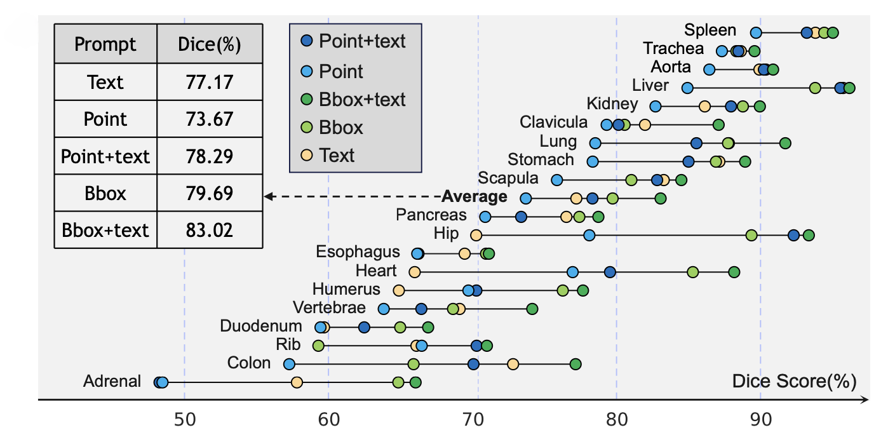

# Medical Multimodal Segmentation Using Foundation Models

### Danny van den Berg, Jesse Brouwers, Taiki Papandreou, and Roan van Blanken
#### Teaching Assistant: Stefanos Achlatis

## Overview

In this blog post, we discuss, reproduce, and extend on the findings of the paper titled ”SegVol: Universal and Interactive Volumetric Medical Image Segmentation” [[4]](#p4). The paper introduces a 3D foundation segmentation model (SegVol) supporting universal and interactive volumetric medical image segmentation. The authors showcase the effectiveness of SegVol in the domain of medical imaging.

The purpose of this blog post is threefold:

1. Help other researchers understand SegVol
2. Verify the authors’ claims by reproducing a subset of the results.
3. Extend on discussion points of the paper.

## Introduction

### The field of medical imaging
Medical imaging has revolutionized the healthcare industry by enabling non-invasive visualization of the internal structures of the human body. Techniques such as Computed Tomography (CT) and Magnetic Resonance Imaging (MRI) have become indispensable tools for diagnosis, treatment planning, and follow-up in various medical fields. Accurate interpretation of these images is crucial for correct diagnosis and effective treatment, and this is where the field of image segmentation plays a vital role.

Image segmentation is the process of partitioning an image into meaningful segments, such as organs, tumors, or lesions. This is essential for numerous clinical applications, including surgical planning, radiotherapy, and disease monitoring. Correct segmentation is particularly critical in cancer treatment, where it helps to minimize radiation damage to healthy tissues and maximize the dose to tumors. The primary goals in medical image segmentation are to achieve high accuracy, speed, and efficiency. Accurate segmentation ensures that clinicians can make precise assessments and decisions. Speed is vital for real-time applications, such as during surgical procedures or radiotherapy sessions where immediate adjustments may be needed. Efficiency encompasses the computational resources required, including memory and processing power, which is critical in clinical settings with limited hardware capabilities. Despite significant advancements, several challenges persist in medical image segmentation. The variability and complexity of anatomical structures, the presence of noise and artifacts in medical images, and the scarcity of annotated training data are key obstacles.

### Related Work
Before going into the details of SegVol, it is essential to explore existing research in the field of medical image segmentation. Traditional segmentation models often face challenges in accurately segmenting complex structures like tumors and cysts due to insufficient training data and a lack of ability to leverage spatial information from user interaction, which results in subpar performance [[9]](#p9). Moreover, many traditional methods utilize a sliding window approach for processing volumetric data, which is computationally expensive and inefficient, as it captures only local information without providing a comprehensive view of the entire volume. Recent adaptations of Segment Anything Model (SAM) for medical imaging have shown mixed results. SAM-Med2D [[2]](#p2) incorporates 2D adapters to process medical images slice-by-slice using SAM’s prompt-based segmentation approach, but it overlooks the 3D spatial context in volumetric data, leading to fragmented segmentation and missing inter-slice continuity. To address this, SAM-Med3D [[13]](#p13) extends SAM to directly operate on 3D volumetric data using 3D Vision Transformers (3D ViT), which capture detailed three-dimensional contexts and improve segmentation accuracy and robustness. However, SAM-Med3D’s high computational resource requirements present practical challenges for real-time clinical application. Other models have also made significant contributions to medical image segmentation. Swin-UNet [[1]](#p1) integrates Swin Transformers to achieve high-resolution segmentation outputs through a hierarchical architecture that processes images in non-overlapping local windows, shifting these windows across various layers to capture both local and global contexts. This multi-level feature representation produces detailed and precise segmentation maps. Similarly, UNETR [[7]](#p7) combines U-Net’s hierarchical feature extraction with Transformers' global context aggregation to capture long-range dependencies across slices, enhancing segmentation accuracy through multi-head self-attention mechanisms. CT-SAM3D [[6]](#p6) represents a further evolution by merging the strengths of transformers and convolutional layers in a U-shaped architecture, allowing for multi-scale feature extraction and fusion and addressing deficiencies in purely transformer-based approaches. The combination of local and global features in CT-SAM3D leads to superior performance across a wide range of medical imaging tasks, including SegVol. However, due to the absence of a public codebase, we decided to conduct our experiments on SegVol.

### An analysis of the paper and its key components

The paper ”SegVol: Universal and Interactive Volumetric Medical Image Segmentation” [[4]](#p4) introduces a 3D foundation model for interactive volumetric medical image segmentation. Volumetric image segmentation, where 3D regions of interest such as organs, tumors, or lesions are modeled from medical images, plays an increasingly prevalent role in clinical applications such as tumor monitoring and disease diagnosis, making it a highly relevant topic of research. SegVol is a segmentation model that directly acts on 3D volumetric data rather than 2D medical segmentation models acting on 2D slices of a volume. This approach is more challenging due to the high resource consumption required for computation on such volumes and the scarcity of labeled data.

In the medical field, we urgently need advanced models that can perform rapid, on-the-fly segmentation on different tools for real-time radiotherapy. This capability is crucial for improving the accuracy and effectiveness of treatment by allowing immediate and precise adjustments during sessions. Real-time segmentation can reduce unnecessary radiation exposure to healthy tissues and focus more accurately on target areas, leading to quicker decision-making and better patient outcomes. SegVol accounts to meet these needs with its robust 3D foundation model, offering interactive volumetric segmentation.

The authors identify three critical limitations that hinder significant advancement in 3D segmentation models. Firstly, publicly available volumetric medical image data is scarce and usually consists of a small number of mask annotations. Secondly, the label spaces of different datasets differ slightly (e.g., left lung and right lung instead of lung), making it challenging for traditional models to disambiguate between the two due to their lack of capacity to capture the semantics of labels. Finally, previous solutions are computationally demanding in the inference process. Recent solutions have employed segmentation models using spatial prompts, but most do not process 3D input directly, and none understand the semantics of anatomical categories. This work aims to address these challenges by proposing methods that seek to improve the handling of scarce data, nuanced label spaces, and computational efficiency.

The primary contributions that address the aforementioned challenges are large-scale pre-training and fine-tuning of the proposed multi-modal model on a large dataset consisting of a collection of publicly available CT-scan image datasets. The authors contribute an innovative prompt mechanism that enables segmentation based on both spatial and semantic prompts, which enables interactive usage during inference and is claimed to positively contribute to performance. Additionally, the authors contribute a zoom-out-zoom-in strategy that supposedly significantly reduces the cost of computation. The SegVol architecture is also claimed to be generalizable to other modalities such as MRI data. Finally, the authors claim that SegVol achieves state-of-the-art results in comparison with traditional task-specific techniques, and other interactive volumetric medical image segmentation models.

In this blog post, the aim is to take a deep dive into the field of medical imaging by covering this paper in detail and validating the claims made by the authors by reproducing a subset of the experiments presented in the paper and we will report on the reproducibility of this work. Furthermore, we will assess the robustness of the model to rotational augmentations of the input data and substantiate a hypothesized solution to mitigate this shortcoming based on group equivariant deep learning. Next, we will cover the method in greater detail.

## Method

*This section delves into the detailed workings of SegVol, covering its dataset processing techniques, model architecture, and the innovative methods employed to enhance volumetric medical image segmentation.*

### Dataset and its processing

To tackle the main challenge in volumetric medical image segmentation, namely the absence of large open-source volumetric medical datasets containing annotated CT-scans, the authors collected 25 datasets that are publicly available and combined them into one large dataset. As the wide variety of volumes in this dataset originate from different machines, with varying parameter settings, the data has a notably wide distribution. To mitigate this problem, the authors standardize the dataset.

An additional challenge is the problem of missing labels, as numerous datasets contain only labels for a small number of targets. This may result in the model learning correlations between datasets and segmentation targets, which may result in reduced performance during inference. To mitigate this problem, the authors apply the unsupervised Felzenswalb-Huttenlocher (FH) algorithm [[5]](#p5) to generate pseudo-masks. This helps break dataset-specific learning, i.e., it helps mitigate the problem of a model learning to associate certain targets with datasets rather than learning the true anatomical features.

The FH algorithm is a graph-based image segmentation method that conceptualizes the image as a graph where each pixel represents a node, and edges between these nodes are determined by pixel similarity. The algorithm constructs segments by comparing internal and external differences within a minimum spanning tree framework, ensuring that the segments are as homogeneous as possible [[5]](#p5). By using the FH algorithm to generate these pseudo-masks, the authors can guide the model to learn the true anatomical structures present in the images rather than overfitting to dataset-specific artifacts.

However, pseudo-masks derived by the FH algorithm contain substantial noise and numerous small masks, for example, the disconnection of a complete structure and the wrong connection of different structures. To improve the pseudo-masks, authors employ the following strategies: 1) The pseudo-masks are replaced with ground truth masks when applicable. 2) Filter out tiny structures smaller than 0.001% of the whole volume. 3) Each mask is refined by dilation and erosion operations.

Next, we will cover the architecture of the foundation model.

### Model architecture

In this section, we explore the SegVol model architecture in detail, focusing on its components and mechanisms that enable effective volumetric medical image segmentation. The model's design integrates multiple encoders and a unique zoom-out-zoom-in mechanism to address the complexities of 3D data processing.

<table align="center">
  <tr align="center">
      <td></td>
  </tr>
  <tr align="left">
    <td colspan=2><b>Figure 1.</b> Graphic overview of SegVol <a href="#p4">[4]</a>.</td>
  </tr>
</table>

A holistic view of the model is shown in Figure 1. The model consists of 5 core components: An image encoder that embeds the volume, a spatial encoder that embeds the spatial prompts, a semantic encoder that embeds the labels, a fusion encoder which encodes the embeddings of different modalities into mask embeddings and finally a mask decoder that decodes these embeddings to produce output masks. For the image encoder, the Vision Transformer (ViT) [[3]](#p3) is employed to encode the CT-scan volume as a sequence of patch-blocks. This is performed using pre-training according to the SiMiM algorithm [[14]](#p14) on the entire dataset, followed by fine-tuning on a subset of six thousand volumes. As semantic label encoder, SegVol employs the text encoder from CLIP [[12]](#p12). CLIP is used off the shelf by using the template: ”A computerized tomography of a .”, and is frozen during training. Inspired by the foundation model for segmentation, segment-anything-model (SAM) [[11]](#p11), the authors use the point and bounding-box prompts to create spatial embeddings. Finally, self-attention and cross-attention represented by the fusion encoder combines the embeddings of the different modalities which generate the final mask embeddings. Using transposed convolutions and interpolation the predicted mask is generated.

### Evaluation Metrics

To evaluate, the original authors employ the Dice Similarity Coefficient (Dice score) to evaluate the model’s performance. The Dice score is defined as:

$$
\text{Dice Score} = \frac{2|X \cap Y|}{|X| + |Y|}
$$

In this equation, |X ∩ Y| represents the cardinality of the intersection between the predicted segmentation set X and the ground truth set Y. The terms |X| and |Y| refer to the cardinalities of the sets X and Y, respectively. The Dice score is a widely used metric in image segmentation tasks, as it quantifies the similarity between the predicted and true segmentations. This makes it particularly effective for assessing the degree of overlap in binary segmentation results.

## Experiments

This section provides an overview of some of the experiments conducted by the authors to validate their claims. Additional experiments have been conducted, however, the datasets for these experiments were not openly available and are therefor not reproducible. In order to reproduce the experiments, the original code was provided, though it lacked functionalities for plot reproduction, and additional code for saving, loading, and evaluating results had to be implemented. Furthermore, the inference pipeline was not provided, so we had to write our own test dataloader and inference pipeline. Finally, not all commands were documented in the README file, necessitating further investigation to accurately replicate the experiments.

### Experiment 1

First, the authors compare their model against task-specific segmentation models, both CNN-based and transformer-based. Validation experiments are performed on a subset of five datasets that have not been seen during training. The tasks focus on organ and lesion segmentation. The results of this experiment are shown using violin plots in Figure 2.

A violin plot combines elements of a box plot and a density plot to show data distribution, with wider sections indicating higher data density. This visualization helps reveal the spread and concentration of values more effectively than a standard box plot.

<table align="center">
  <tr align="center">
      <td></td>
  </tr>
  <tr align="left">
    <td colspan=2><b>Figure 2.</b> Violin plots for comparing experiment results of SegVol and task-specific methods. The vertical axis shows the Dice score <a href="#p4">[4]</a>.</td>
  </tr>
</table>

This figure demonstrates that SegVol is performing as the best, or one of the best on average in all segmentation tasks evaluated in this experiment. This is showcased by the red dots within each violin. Additionally, this figure demonstrates that SegVol has a much narrower distribution in comparison with the other methods which suggests that SegVol is more robust than the other methods. This experiment effectively demonstrates SegVol to outperform task-specific models on a wide variety of segmentation tasks. To validate the claim that SegVol achieves state-of-the-art performance in medical image segmentation, the authors additionally have to compare with other interactive segmentation methods which is done next.

### Experiment 2

To determine the optimal prompt configuration, and to validate the claim that the joint use of spatial and semantic prompts have a positive effect on the performance, the authors provide results of an experiment where different prompt configurations are compared with each other by evaluating the different configurations on 19 segmentation tasks. The results are displayed in Figure 5.

<table align="center">
  <tr align="center">
      <td></td>
  </tr>
  <tr align="left">
    <td colspan=2><b>Figure 5.</b> The quantitative experimental results on 19 internal tasks demonstrate that jointly using semantic and spatial prompts can achieve better performances <a href="#p4">[4]</a>.</td>
  </tr>
</table>

The results clearly demonstrate the advantage of using bounding-box prompts jointly with textual prompts, as this configuration (i.e. the dark green point) achieves the best performance on all tasks. This substantiates the claim that the addition of semantic information to the model through textual prompts positively benefits segmentation performance.

## Assessment of the SegVol architecture
In this section we will assess the capabilities of the SegVol architecture. First we will reproduce a subset of the previously covered experiments, and evaluate the corresponding claims made by the authors. Secondly, we will assess the robustness of the SegVol architecture to global rotations of the input data.

As mentioned in the previous section, a significant number of experiments cannot be reproduced due to the incompleteness of the datasets provided by the authors. However, the datasets for experiment one are fully available, making this a suitable experiment to assess and validate the claimed performance of the SegVol architecture. These datasets include  [BTCV](https://www.synapse.org/#!Synapse:syn3193805/wiki/217753) and [MSD-spleen](http://medicaldecathlon.com/) datasets, which focus on organ segmentation, and from [MSD-lung](http://medicaldecathlon.com/), [MSD-Colon](http://medicaldecathlon.com/), and [MSD-Liver](http://medicaldecathlon.com/) datasets, which focus on lesion segmentation.  Additionally, we perform extensive analysis on the different prompting configurations to validate the authors' claim that the joint use of spatial and semantic prompts positively impacts performance. Due to limited computational resources, we decided to validate the impact of the prompting configurations on the same subset of five datasets. The results of these reproducibility experiments are shown in Table 2. 

  <table>
    <caption><b>Table 2: </b>Results for reproducing Experiment 1</caption>
    <thead>
      <tr>
        <th>Category</th>
        <th>SegVol</th>
        <th>Our Results</th>
      </tr>
    </thead>
    <tbody>
      <tr>
        <td>Aorta</td>
        <td>0.9179</td>
        <td>0.908332</td>
      </tr>
      <tr>
        <td>Colon cancer</td>
        <td>0.7582</td>
        <td>0.672054</td>
      </tr>
      <tr>
        <td>Esophagus</td>
        <td>0.7373</td>
        <td>0.707955</td>
      </tr>
      <tr>
        <td>Gallbladder</td>
        <td>0.8560</td>
        <td>0.751226</td>
      </tr>
      <tr>
        <td>Inferior vena cava</td>
        <td>0.8267</td>
        <td>0.833241</td>
      </tr>
      <tr>
        <td>Left adrenal gland</td>
        <td>0.7643</td>
        <td>0.717314</td>
      </tr>
      <tr>
        <td>Left kidney</td>
        <td>0.9296</td>
        <td>0.930124</td>
      </tr>
      <tr>
        <td>Liver</td>
        <td>0.9560</td>
        <td>0.958999</td>
      </tr>
      <tr>
        <td>Liver tumor</td>
        <td>0.7801</td>
        <td>0.000000</td>
      </tr>
      <tr>
        <td>Lung tumor</td>
        <td>0.7250</td>
        <td>0.704089</td>
      </tr>
      <tr>
        <td>Pancreas</td>
        <td>0.8464</td>
        <td>0.823274</td>
      </tr>
      <tr>
        <td>Portal/splenic vein</td>
        <td>0.7188</td>
        <td>0.740582</td>
      </tr>
      <tr>
        <td>Right adrenal gland</td>
        <td>0.6579</td>
        <td>0.667120</td>
      </tr>
      <tr>
        <td>Right kidney</td>
        <td>0.9227</td>
        <td>0.922879</td>
      </tr>
      <tr>
        <td>Spleen</td>
        <td>0.9642</td>
        <td>0.961387</td>
      </tr>
      <tr>
        <td>Stomach</td>
        <td>0.9177</td>
        <td>0.914470</td>
      </tr>
    </tbody>
  </table>

The results displayed in the first two columns show that our findings are approximately in line with those provided by the authors, with a few exceptions. A notable exception is our result for the liver tumor, which yielded a dice score of zero. The cause of this discrepancy is not entirely clear, but it is suspected to be due to corrupted data loading. Overall, the reproducibility experiment succeeds in validating the segmentation capabilities of the network.

When considering the other results, ... (results to be included)

## Testing SegVol's geometric robustness
In clinical practice, a patient's positioning during imaging procedure often varies, introducing rotational differences in medical images. This variability can lead to inconsistencies in image segmentation. Such inconsistencies can be dangerous, especially in cancer treatment, where precise targeting is essential to minimize damage to healthy tissues while maximizing the radiation dose to unhealthy tissues. Given that bodies and organs may naturally move and rotate, these rotational differences can impact the accuracy and reliability of segmentation models. This is why it is crucial to assess and enhance the robustness of segmentation models like SegVol against such rotations. For real-time radiotherapy treatment planning, it is imperative to obtain real-time images of patients during treatment from the specific gantry where radiation is administered. This requires a rapid segmentation algorithm capable of processing images from that specific viewpoint. By utilizing a geometric-aware model, we can achieve real-time segmentation for various gantry angles, thereby advancing towards real-time radiotherapy with consistently precise segmentations. Therefore, enhancing SegVol’s rotation robustness is essential for improved model’s performance and clinical outcomes. 

Since a medical imaging scan is typically taken by a scanning machine that rotates around the longitudinal axis of the patient, this is the main axis of rotation we consider when assessing the robustness of the architecture. An example of such a rotation is displayed in figure 6. 

<table align="center">
  <tr align="center">
      <td></td>
  </tr>
  <tr align="left">
    <td colspan=2><b>Figure 6.</b>Example of Rotation.</td>
  </tr>
</table>

In our experiment, we rotate each volume 45 degrees around the longitudinal axis and 5.73 degrees (0.1 radian) around the other two axes. The results are subsequently compared to the performance of the same volumes in their original orientation. The experimental results are shown in Figure 7.

<table align="center">
  <tr align="center">
      <td></td>
  </tr>
  <tr align="left">
    <td colspan=2><b>Figure 7.</b>Mean Dice Score for each organ using both spatial and semantic prompts on rotated and normal data.</td>
  </tr>
</table>

The results demonstrate that the model achieves poorer performance on all organs when segmenting the rotated volumes. For certain organs, such as the liver, the drop in performance is very slight, while for other targets, such as the stomach, the drop can be as much as 26 percent. On average, the model performs approximately ten percent worse on rotated volumes leaving significant room for improvement in terms of robustness to global rotations. 

##  Exposition of its weaknesses/strengths/potential

So far, we gave a comprehensive explanation of SegVol’s paper. In this section, we will outline the model’s strengths, weaknesses and idea on improvement as a way to give an overview.

#### Strengths:

1. Advanced segmentation capabilities: SegVol’s ability to handle volumetric data through interactive prompts is a notable strength. This capability allows for precise segmentation across various medical imaging modalities.
2. Integration with foundation models: By leveraging transformer architectures and integrating with foundation models like the Segment Anything Model (SAM), SegVol benefits from the robustness and versatility of these advanced models. This integration leads to better performance in diverse tasks and contexts.
3. Interactive segmentation: SegVol supports point and bounding box prompts, which enhance its flexibility and user-friendliness in clinical settings. This interactivity allows for more accurate and tailored segmentation results.

#### Weaknesses:

1. Lack of robustness to rotations and translations: One critical weakness is the model’s sensitivity to rotational and translational variations in the data. Medical images, particularly CT scans, often exhibit significant variations due to patient movement, anatomical changes over time, and different imaging angles. Current models like SegVol have not systematically addressed these variations, which is crucial for clinical applications where precision is paramount.
2. Generalization issues: While SegVol shows promising results on specific datasets, its performance on unseen data or different anatomical structures can be inconsistent. For example, segmentation performance on unseen organs like the sternum requires multiple prompts to achieve accuracy comparable to supervised models, indicating potential generalization limitations.
3. Computational demands: The use of transformer-based architectures and large-scale models introduces substantial computational requirements, which can be a barrier to clinical adoption, especially in resource-constrained settings.

#### Potential for Improvement:
1. **Enhanced Robustness through Equivariance**: Addressing the robustness issues, particularly regarding rotations and translations, is critical. Incorporating techniques such as group equivariant convolutions can help in creating low-level features that are inherently invariant to these transformations. This improvement would make the model more reliable in varying clinical scenarios, such as different patient positions or imaging protocols.

## Our Novel Contribution
### Quick recap on SO(3)-Convolution
**WIP** (vervanged door Danny) 
Group equivariant convolutional neural networks (GCNNs) further enhance classical convolutional networks by introducing additional inductive biases, such as rotational symmetry, which constrain the network to produce representations that comply with the specified symmetries. For example, a rotation in the input should result in a corresponding rotation in the output, this makes them especially suitable for tasks involving complex transformations like 3D object recognition. This symmetry compliance also results in a more efficient learning process since fewer kernels are required to capture the same representational capacity. Where lifted convolutions use several transformations of the same filter, steerable convolutions utilize a set of basis filters combined linearly to achieve the desired transformation.This results in a much more memory-efficient design, as fewer parameters are needed to encode continuous group transformations like those in SO(3). The mathematical foundation of steerable convolutions is rooted in group theory and irreducible representations, which decompose complex transformations into simpler, invariant components.The primary advantages include reduced memory footprint and improved performance in recognizing objects and patterns irrespective of their orientation or location, offering a flexible and mathematically principled approach to incorporate various symmetries into neural networks.

We will be using the ESCNN (Enhanced Steerable CNN) library to implement steering convolutions. This library allows for several isometries like rotations and reflections in both 2D and 3D spaces. We chose to use steerable CNNs as we have the need for infinite groups such as 3D rotations, where memory utilization is already significant due to the nature of the data. In ESCNN, equivariant convolutions are achieved through utilizing feature maps of E(n)-equivariant steerable CNNs called feature fields, which transform predictably under operations like rotations and reflections. These feature fields can be scalar (like in gray-scale images) or n-dimensional vector fields, each transforming differently under such operations. Users can define input and output feature spaces for convolutions and create mappings similar to traditional convolutions, but with the added capability of handling group symmetries, thus facilitating the adoption of steerable convolutions into deep learning models.

For our experiments we have used a rotation equivariant steerable convolution in the ESCNN library. This steerable convolution is initialized with a kernel size and stride equal to the patch size which is 16. Further it is initalised using both a scalar in and out type. In addition there will be 1 input channel and 768 output channels, similar to the original patch embedding for the original adapter.

##  Proposed Innovation/Solution
Previous sections have highlighted the importance of robustness to rotations in medical imaging architectures. We have assessed the robustness of the medical segmentation foundation model, SegVol, and have demonstrated discrepancies in segmentation performance between volumes rotated 45 degrees and those that are not. This finding motivated us to investigate possible improvements.

The Vision Transformer (ViT) used as the image encoder in the SegVol network was trained on 96,000 CT-scan images for 2,000 epochs, a significant computational effort that we cannot replicate due to dataset unavailability and limited computational resources. Consequently, we must consider more efficient adaptation methods.

Recently, foundation models have been increasingly developed and deployed on larger scales, which has naturally increased the computational burden of training, fine-tuning, and performing inference with these models. As a result, significant research has been done to more efficiently adapt such models for desired use cases. One such method is low-rank adaptation (LoRA) [[15]](#p15), which proposes adapting the weight matrices of dense layers within an architecture using two learnable low-rank decomposition matrices. When adapting GPT-3, a 1.7 billion parameter model, to a downstream task, LoRA can achieve the same fine-tuning performance while only training 4.7 million parameters and keeping the rest of the model frozen [[15]](#p15). Zhu et al. [[16]](#p16) demonstrated the effectiveness of LoRA within the medical imaging domain by proposing their architecture MeLO, showing that fine-tuning a vision transformer on medical imaging tasks can be done using 0.17 percent of the parameters while maintaining similar performance to full fine-tuning.

Another strategy to efficiently adapt a large pre-trained network is side-tuning [[17]](#p17), where a small side-network is trained for a specific downstream task while the original larger network remains frozen. In this approach, the trainable side-network learns novel task-specific information, and the model combines the output of the side-network with the pre-trained network to make predictions.

Building on these ideas of efficient adaptation methods, we propose adjusting the image encoder of the SegVol network to include a specialized module incorporating a rotational inductive bias. Our research question is as follows:

*How effectively can incorporating a specialized module with rotational inductive bias enhance the robustness to rotations in a pre-trained network using parameter-efficient adaptation techniques?*

To answer this research question, we will use a strategy similar to side-tuning, merging the output of the novel patch embeddings with the original frozen pre-trained patch embeddings using a feedforward layer to incorporate geometric information within the network. Since the patch embeddings are calculated and included at the lowest level of the foundation model, we hypothesize that the transformer blocks acting on the input sequence of patch embeddings must also be slightly adjusted to the altered input distribution. To address this problem, we propose injecting LoRA modules on top of the linear out-projection layers within each transformer block. This way, the transformer blocks can slightly adapt to the new input distribution as well.

Some research has been done so far on making transformers equivariant. For instance, Xu et al. have done research on an E(2)-equivariant vision transformer. A different paper from Fuchs et al. shows a 3D Roto-Translation equivariant attention network however this is specifically tailored for point cloud data. Even though we cannot use exactly the same idea, this paper did give the global idea of bringing in equivariance on the low level features, with the hypothesis of making everything further downstream equivariant as well. As there is no further research so far on SO(3) equivariant ViTs we decided to build on this idea, bringing equivariance in the low level features in the adapter. In order to do so we decided to add a novel patch embedding which makes use of steering convolutions and who’s output simply concatenates to the original adapter’s output. Our hypothesis is then that this will not make the network fully equivariant as we still concatenate the old adapter as well as positional embeddings, but we do expect that this will bring in some degree of SO(3) equivariance.

## Method
In this section, the method of our proposed adaptation technique will be explained. First, we will explain the choices made when creating the module with the induced rotational bias. Secondly, we will specify the choices made regarding the efficient adaptation of the foundation model SegVol.

### Induced Patch Embedding Block
(Also see demo ./demos/SO3_patchembedding.ipynb)

### Adaptation Techniques
An overview of our proposed adapted ViT is displayed in Figure 8.
<table align="center">
  <tr align="center">
      <td></td>
  </tr>
  <tr align="left">
    <td colspan=2><b>Figure 8.</b> The proposed adapted Vision Transformer architecture.</a></td>
  </tr>
</table>

Similar to side-tuning, we deploy our patch embedding block with the induced rotational bias jointly with the original pre-trained patch embedding module. We decided to use this strategy because we wanted to use the pre-trained weights of the extensively trained, frozen patch-embedding block, and also avoid removing the original input signal entirely. However, this results in an input sequence consisting of significantly more block embeddings compared to the original model. To ensure the sequence size matches that of the original architecture, we concatenate the two sequences of block embeddings and map them to a dimensionality compatible with the original architecture using an adapter consisting of a feedforward neural network. This contrasts with the side-tuning architecture [[17]](#p17), where the outputs of two networks are merged using a gating mechanism.

We hypothesize that the transformer blocks need to slightly adjust their weights to adapt to the different input data. To incorporate this into our network, we draw inspiration from the MeLO architecture [[16]](#p16), which was briefly mentioned previously. MeLO demonstrated that LoRA is a suitable adaptation technique when adapting Vision Transformers in the medical imaging domain.

Table 3 gives an overview on the number of (trainable) parameters.

  <table>
    <caption><b>Table 3:</b> Overview of parameter counts.</caption>
    <thead>
      <tr>
        <th></th>
        <th>Total</th>
        <th>Trainable</th>
        <th>%trainable</th>
      </tr>
    </thead>
    <tbody>
      <tr>
        <td>Original ViT</td>
        <td>85.8M</td>
        <td>85.8M</td>
        <td>100</td>
      </tr>
      <tr>
        <td>Proposed ViT excl LoRA</td>
        <td>90.4M</td>
        <td>4.6M</td>
        <td>5.1</td>
      </tr>
      <tr>
        <td>Proposed ViT incl LoRA</td>
        <td>90.7M</td>
        <td>4.9M</td>
        <td>5.4</td>
      </tr>
    </tbody>
  </table>

The table demonstrates the extent to which we reduced the number of trainable parameters using our parameter-efficient adaptation techniques. This significant reduction of trainable parameters enables us to fine-tune the foundation model using the limited time and compute available to us.

##  Experiments
⚠️***Note: We are still working on these.***

**We move this to a different place**
Coordinate system in medical images:
The coordinate system in medical imaging consists of mainly three three systems: the world, anatomical, and the medical image coordinate system as seen in figure 9. In our experiment, we manipulated the images by performing rotations along the Z-axis in the world coordinate system, i.e. rotating along the axial plane anatomical coordinate system or along the k axis in medical image coordinate system.

<!-- <table align="center">
  <tr align="center">
      <td></td>
  </tr>
  <tr align="left">
    <td colspan=2><b>Figure 9.</b> Coordinate systems in medical imaging. From left we have a visualization of world, anatomical, and the medical image coordinate system.</td>
  </tr>
</table> -->

<table align="center">
  <tr align="center">
      <td></td>
  </tr>
  <tr align="left">
    <td colspan=2><b>Figure 10.</b></a></td>
  </tr>
</table>

<table align="center">
  <tr align="center">
      <td></td>
  </tr>
  <tr align="left">
    <td colspan=2><b>Figure 11.</b></a></td>
  </tr>
</table>

<table align="center">
  <tr align="center">
      <td></td>
  </tr>
  <tr align="left">
    <td colspan=2><b>Figure 12.</b></a></td>
  </tr>
</table>

<table align="center">
  <tr align="center">
      <td></td>
  </tr>
  <tr align="left">
    <td colspan=2><b>Figure 13.</b></a></td>
  </tr>
</table>

## Concluding Remarks

## Work load
Danny: Contributed to the overall blog post, implemented the SO(3) patch embedding block, and assisted with the inference pipeline. Developed the proposed adaptation technique, helped refine the experimental setup, and assisted with the initial implementation of the transformer-based architecture.

Taiki: Explained the mathematical background and motivations behind steerable convolutions and SO(3) equivariance. Investigated translational equivariance, elaborated on medical terms, and explained the Felzenswalb-Huttenlocher algorithm. Made references clickable and contributed to related work and the introduction sections, emphasizing the medical relevance of rotation robustness. Structured the repository and implemented reproducibility experiment configurations.

Jesse: Designed the proposed architecture, and contributed motivations behind hyperparameter and design choices. Investigated literature on adaptation techniques, cleaned the repository, and merged cleaned inference code with train scripts. Created the model diagram and the demo notebook of the SO3 patchembedding block. Implemented the pipeline for our contribution and conducted the inference pipeline setup with Danny. Produced visualizations and analyses for "Reproduction of the Experiments," and assisted with run executions, figures, and tables for other sections.

Roan: Provided better explanations of plots, described all dataset components, combined the original experiments with the reproduction section, and defined and tested the z-axis accuracy. Evaluated plots, adjusted the inference pipeline, and facilitated the dataset solution on Snellius with Jesse and Taiki. Executed experiments and produced visualizations and analyses for "Reproduction of the Experiments."

## References
<a id="p1">[1]</a> Hu Cao, Yueyue Wang, Joy Chen, Dongsheng Jiang, Xiaopeng Zhang, Qi Tian, and Manning Wang. Swin-unet: Unet like pure transformer for medical image segmentation. In European conference on computer vision, pages 205–218. Springer, 2022.

<a id="p2">[2]</a> Junlong Cheng, Jin Ye, Zhongying Deng, Jianpin Chen, Tianbin Li, Haoyu Wang, Yanzhou Su, Ziyan Huang, Jilong Chen, Lei Jiang, et al. Sam-med2d. arXiv preprint arXiv:2308.16184, 2023.

<a id="p3">[3]</a> Alexey Dosovitskiy, Lucas Beyer, Alexander Kolesnikov, Dirk Weissenborn, Xiaohua Zhai, Thomas Unterthiner, Mostafa Dehghani, Matthias Minderer, Georg Heigold, Sylvain Gelly, et al. An image is worth 16x16 words: Transformers for image recognition at scale. arXiv preprint arXiv:2010.11929, 2020.

<a id="p4">[4]</a> Yuxin Du, Fan Bai, Tiejun Huang, and Bo Zhao. Segvol: Universal and interactive volumetric medical image segmentation. arXiv preprint arXiv:2311.13385, 2023.

<a id="p5">[5]</a> Pedro F Felzenszwalb and Daniel P Huttenlocher. Efficient graph-based image segmentation. International journal of computer vision, 59:167–181, 2004.

<a id="p6">[6]</a> Heng Guo, Jianfeng Zhang, Jiaxing Huang, Tony CW Mok, Dazhou Guo, Ke Yan, Le Lu, Dakai Jin, and Minfeng Xu. Towards a comprehensive, efficient and promptable anatomic structure segmentation model using 3d whole-body ct scans. arXiv preprint arXiv:2403.15063, 2024.

<a id="p7">[7]</a> Ali Hatamizadeh, Yucheng Tang, Vishwesh Nath, Dong Yang, Andriy Myronenko, Bennett Landman, Holger R Roth, and Daguang Xu. Unetr: Transformers for 3d medical image segmentation. In Proceedings of the IEEE/CVF winter conference on applications of computer vision, pages 574–584, 2022.

<a id="p8">[8]</a> Neil Houlsby, Andrei Giurgiu, Stanislaw Jastrzebski, Bruna Morrone, Quentin De Laroussilhe, Andrea Gesmundo, Mona Attariyan, and Sylvain Gelly. Parameter-efficient transfer learning for nlp. In International conference on machine learning, pages 2790–2799. PMLR, 2019.

<a id="p9">[9]</a> Huiyan Jiang, Zhaoshuo Diao, and Yu-Dong Yao. Deep learning techniques for tumor segmentation: a review. The Journal of Supercomputing, 78(2):1807–1851, 2022.

<a id="p10">[10]</a> Ali Emre Kavur, M Alper Selver, Oguz Dicle, Mustafa Barıs, N Sinem Gezer, et al. Chaos-combined (ct-mr) healthy abdominal organ segmentation challenge data. Med. Image Anal, 69:101950, 2019.

<a id="p11">[11]</a> Alexander Kirillov, Eric Mintun, Nikhila Ravi, Hanzi Mao, Chloe Rolland, Laura Gustafson, Tete Xiao, Spencer Whitehead, Alexander C Berg, Wan-Yen Lo, et al. Segment anything. In Proceedings of the IEEE/CVF International Conference on Computer Vision, pages 4015–4026, 2023.

<a id="p12">[12]</a> Alec Radford, Jong Wook Kim, Chris Hallacy, Aditya Ramesh, Gabriel Goh, Sandhini Agarwal, Girish Sastry, Amanda Askell, Pamela Mishkin, Jack Clark, et al. Learning transferable visual models from natural language supervision. In International conference on machine learning, pages 8748–8763. PMLR, 2021.

<a id="p13">[13]</a> Haoyu Wang, Sizheng Guo, Jin Ye, Zhongying Deng, Junlong Cheng, Tianbin Li, Jianpin Chen, Yanzhou Su, Ziyan Huang, Yiqing Shen, et al. Sam-med3d. arXiv preprint arXiv:2310.15161, 2023.

<a id="p14">[14]</a> Zhenda Xie, Zheng Zhang, Yue Cao, Yutong Lin, Jianmin Bao, Zhuliang Yao, Qi Dai, and Han Hu. Simmim: A simple framework for masked image modeling. In Proceedings of the IEEE/CVF conference on computer vision and pattern recognition, pages 9653–9663, 2022.

<a id="p15">[15]</a> Edward J Hu, Yelong Shen, Phillip Wallis, Zeyuan Allen-Zhu, Yuanzhi Li, Shean Wang, Lu Wang, and Weizhu Chen. Lora: Low-rank adaptation of large language models. arXiv preprint arXiv:2106.09685, 2021. 

<a id="p16">[16]</a> Yitao Zhu, Zhenrong Shen, Zihao Zhao, Sheng Wang, Xin Wang, Xiangyu Zhao, Dinggang Shen, and Qian Wang. Melo: Low-rank adaptation is better than fine-tuning for medical image diagnosis. arXiv preprint arXiv:2311.08236, 2023.

<a id="p17">[17]</a> Jeffrey O Zhang, Alexander Sax, Amir Zamir, Leonidas Guibas, and Jitendra Malik. Side-tuning: a baseline for network adaptation via additive side networks. In Computer Vision–ECCV 2020: 16th European Conference, Glasgow, UK, August 23–28, 2020, Proceedings, Part III 16, pages 698–714. Springer, 2020. 

## Appendix
<table align="center">
  <tr align="center">
      <td></td>
  </tr>
  <tr align="left">
    <td colspan=2><b>Figure 15.</b></td>
  </tr>
</table>
